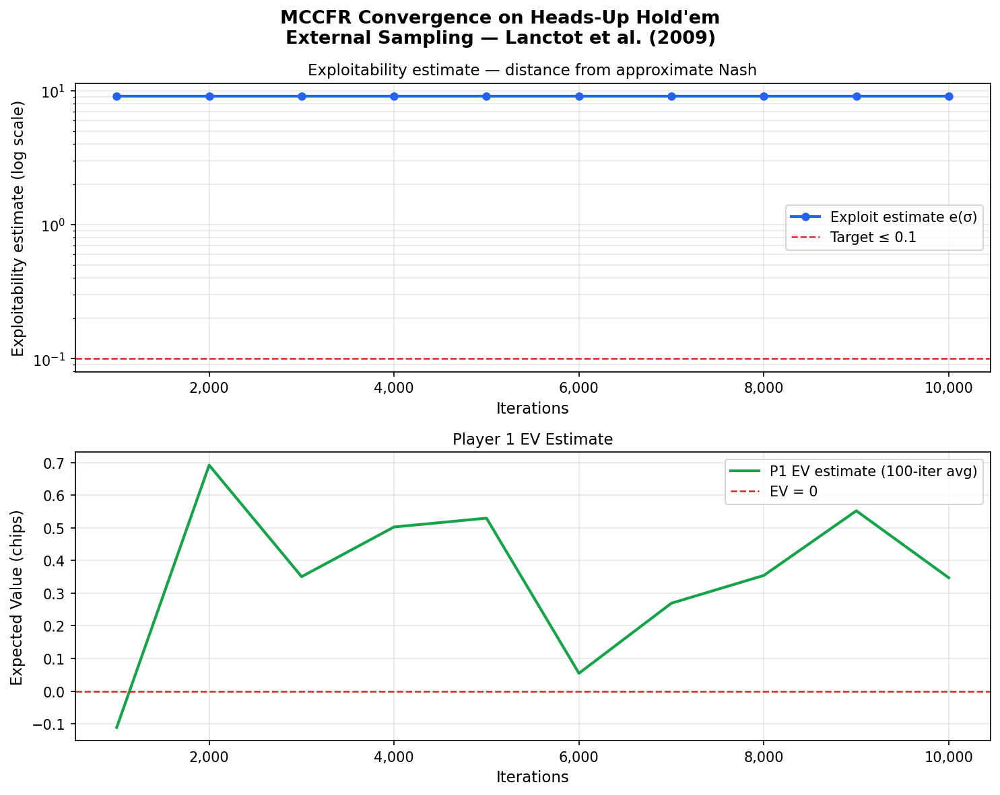
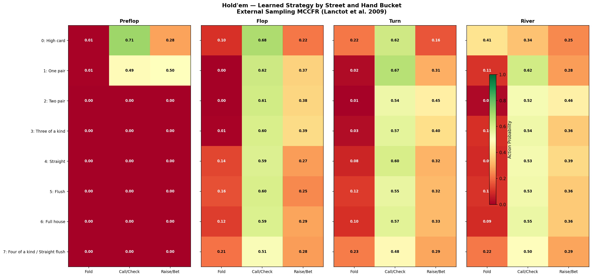
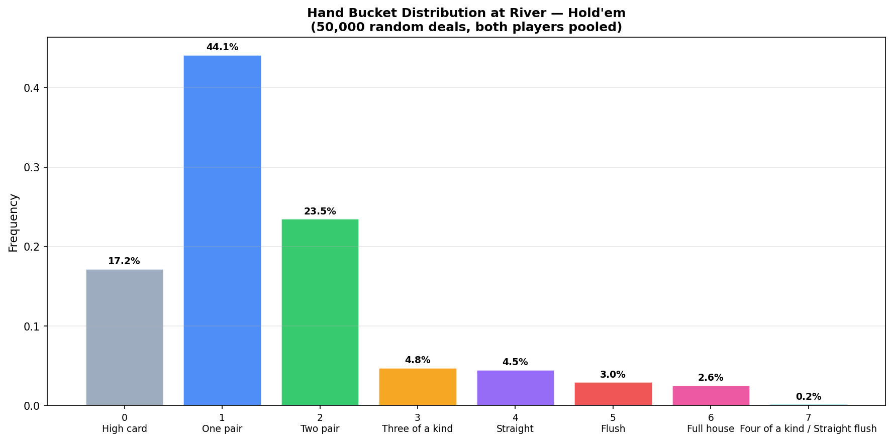

# CFR Poker Solver

Counterfactual Regret Minimization (CFR) implemented from scratch in Python, following Zinkevich et al. (2007) "Regret Minimization in Games with Incomplete Information." The project builds through three poker variants of increasing complexity — Kuhn Poker → Leduc Poker → Heads-Up Hold'em — and ends as a deployed interactive web app.

**Student project:** First year Honours Applied Mathematics, University of Waterloo.

---

## What is CFR?

CFR is the algorithm behind modern poker solvers (PioSOLVER, GTO+, etc.). The idea: play a game thousands of times, track how much you *regret* not having taken a different action at each decision point, and shift your strategy toward actions you regret not taking. The average strategy over all iterations converges to a Nash equilibrium — proven in Theorem 3 of Zinkevich et al.

### Core notation (following the paper)

| Symbol | Meaning |
|---|---|
| `I` | Information set — all game states a player cannot distinguish |
| `σ(I, a)` | Strategy: probability of taking action `a` at infoset `I` |
| `π^σ_{-i}(I)` | Counterfactual reach: opponent's contribution to reaching `I` |
| `R^T_i(I, a)` | Cumulative counterfactual regret for action `a` at infoset `I` |
| `σ̄^T_i` | Average strategy over `T` iterations — this converges to Nash |

### Regret matching

```
σ(I, a) = R⁺(I, a) / Σ_b R⁺(I, b)
```

where `R⁺ = max(R, 0)`. If all regrets are non-positive, play uniformly.

### Two-pass design (correctness requirement)

All nodes must see the **same strategy profile** within one iteration. Updating regrets mid-sweep makes each iteration order-dependent. This implementation uses a strict two-pass design:

1. **Freeze** the current strategy profile as a snapshot
2. **Collect** all regret and strategy deltas across all deals — without writing to nodes
3. **Apply** all updates atomically after the full sweep

---

## Project Structure

```
cfr-poker/
├── kuhn/
│   ├── kuhn_poker.py     # Game environment: rules, payoffs, infoset keys
│   ├── cfr.py            # CFR algorithm: Node, CFRTrainer, Nash reference values
│   ├── analysis.py       # Exploitability, best response, convergence plots
│   └── plots/
│       ├── convergence.png
│       └── strategy_heatmap.png
├── leduc/
│   ├── leduc_poker.py    # Game environment: 2-round, community card, pair logic
│   ├── cfr.py            # LeducCFRTrainer with chance-node enumeration
│   ├── analysis.py       # Exploitability, strategy heatmaps, community card effect
│   └── plots/
│       ├── convergence.png
│       ├── strategy_by_round.png
│       └── community_card_effect.png
├── holdem/
│   ├── holdem_poker.py   # Game environment: 52-card deck, card abstraction, 8 buckets
│   ├── cfr.py            # External Sampling MCCFR (Lanctot et al. 2009)
│   ├── analysis.py       # Exploitability estimate, strategy heatmaps, bucket distribution
│   └── plots/
│       ├── convergence.png
│       ├── strategy_by_street.png
│       └── bucket_distribution.png
├── backend/              # Phase 6 — FastAPI REST API
├── tests/
│   ├── test_kuhn_poker.py    # 34 tests — game environment
│   └── test_cfr_trainer.py   # 18 tests — CFR algorithm and Nash convergence
├── requirements.txt
└── README.md
```

---

## Setup

```bash
git clone https://github.com/RyanArpin/cfr-poker.git
cd cfr-poker
python3 -m venv venv
source venv/bin/activate   # Windows WSL: source venv/bin/activate
pip install -r requirements.txt
```

> Always run scripts from the project root with `PYTHONPATH=.` to avoid import errors.

---

## Phase 1 — Kuhn Poker Environment

Kuhn Poker is the simplest non-trivial poker game, introduced by Harold Kuhn (1950) and the standard CFR benchmark.

**Rules:**
- Deck: Jack (J=0), Queen (Q=1), King (K=2). Each player gets one card; one is burned.
- Both ante 1 chip. One betting round: check (`c`) or bet (`b`), 1 chip.
- If bet, opponent may fold (`f`) or call (`c`). Higher card wins at showdown.

**Game tree:** 4 non-terminal histories, 5 terminal histories, 12 infoset nodes.

**Infoset key format:** `"<card>:<history>"` — e.g. `"K:cb"` (holds King, history is check-then-bet).

```bash
PYTHONPATH=. python kuhn/kuhn_poker.py   # sanity checks
```

**Tests:** 34 passing — card constants, terminal detection, turn order, legal actions, payoffs, infoset keys, deal enumeration, game tree structure.

---

## Phase 2 — CFR on Kuhn Poker

```bash
PYTHONPATH=. python kuhn/cfr.py          # trains 10,000 iterations, prints strategy
python -m pytest tests/ -v               # 52 tests passing
```

### Results after 10,000 iterations

| Infoset | Strategy | Interpretation |
|---|---|---|
| `K:` | bet 63% | King bets for value |
| `Q:` | check 100% | Queen never opens |
| `J:` | bet 21% | Jack bluffs occasionally |
| `K:b` | call 100% | King always calls a bet |
| `Q:b` | call 33% | Queen calls 1/3 to prevent bluffs |
| `J:b` | fold 100% | Jack folds to a bet |
| `K:c` | bet 100% | King always bets after a check |
| `J:c` | bet 34% | Jack bluffs after opponent checks |
| `Q:cb` | call 54% | Queen calls check-bet often enough to deter bluffs |

**Game value:** −1/18 ≈ −0.0556 chips per hand for Player 1. Acting first is a slight *disadvantage* in Kuhn Poker — your bet reveals hand strength without gaining enough in return. Known result from Kuhn (1950).

**Linear weighting:** `strategy_sum` at iteration `t` is multiplied by `t`, so later (more accurate) iterations dominate the average. Improves convergence speed without changing guarantees.

---

## Phase 3 — Exploitability Analysis

```bash
PYTHONPATH=. python kuhn/analysis.py     # trains + generates plots in kuhn/plots/
```

**Exploitability** measures distance from Nash:

```
e(σ) = BR₁_value − BR₂_value
```

Zero at Nash. The best-response computation is done at the *infoset level* — a player cannot condition on the opponent's private card, so action values must be averaged weighted by opponent reach probability before selecting the best action.

### Convergence


Exploitability (top panel) converges to zero on a log scale, consistent with the O(1/√T) bound in Theorem 3 of Zinkevich et al. Player 1's EV (bottom panel) stabilises at −1/18 ≈ −0.0556.

### Strategy Heatmap


Rows are the 12 infosets; columns are passive (check/fold) vs aggressive (bet/call) action probabilities. The King's row is fully green (always aggressive), the Queen's first-action row is fully red (always passive), and the Jack's bluffing rows show intermediate values.

---

## Phase 4 — Leduc Poker

Leduc Poker (Southey et al., 2005) is the standard two-round benchmark with a community card.

**Rules:**
- Deck: J, J, Q, Q, K, K (6 cards, two of each rank)
- Both ante 1 chip. Round 1 bet size = 2, max 1 raise.
- Community card dealt face-up between rounds (chance node).
- Round 2 bet size = 4, max 1 raise.
- Showdown: pair (private matches community) beats non-pair; otherwise higher rank wins.

**Action characters:** `c`=check, `b`=bet, `k`=call, `r`=raise, `f`=fold. (`k` for call avoids collision with `c`=check.)

**History format:** `"<r1_actions>/<community>/<r2_actions>"` — e.g. `"bk/Q/br"`.

**Infoset key format:** `"<rank>/<community_or_->:<history>"` — e.g. `"K/-:b"` (round 1), `"K/J:bk/J/c"` (round 2).

**Dealing model:** The 6-card deck yields 30 ordered private deals. CFR iterates over all 30 uniformly — same-rank pairs (JJ, QQ, KK) appear twice, giving them correct probability weight of 2/30 vs 4/30 for mixed-rank pairs. The community card is conditioned on which two cards were already dealt.

```bash
PYTHONPATH=. python leduc/leduc_poker.py   # sanity checks (30 deals, payoffs, etc.)
PYTHONPATH=. python leduc/cfr.py           # trains 1,000 iterations
PYTHONPATH=. python leduc/analysis.py      # trains + generates 3 plots
```

### Results after 1,000 iterations

- **288 infoset nodes** (vs 12 in Kuhn)
- **EV converging** from ~−0.35 to ~−0.28 (no closed-form Nash EV for Leduc)
- Training time: ~40s per 1,000 iterations on a standard machine

### Convergence


EV decreasing toward Nash as iterations increase.

### Strategy by Round


Side-by-side heatmaps: Round 1 infosets (left) and Round 2 infosets (right). Each row is one infoset; columns show passive vs aggressive action probability. The pair-making effect in Round 2 is clearly visible — infosets where the player holds a pair become deeply green (very aggressive).

### Community Card Effect


Round 2 aggression probability broken down by private card (J/Q/K) × community card. The spike when private card matches community card (pair made) is clearly visible in each subplot — the pair-making community card (highlighted in red border) triggers dramatically higher aggression.

**Key design difference from Kuhn:** The `LeducCFRTrainer` handles the chance node between rounds by iterating over all possible community cards weighted by their posterior probability, inside `_collect_updates()`. No changes to the two-pass architecture or the `Node` class were needed.

---

## Phase 5 — Heads-Up Texas Hold'em with Monte Carlo CFR

Texas Hold'em is the dominant form of modern poker and the target of serious GTO solvers.  The full game tree is intractable for exact CFR (~10¹⁴ information sets), so two techniques make it tractable here:

**Card abstraction:** Map each player's hand (2 hole cards + up to 5 community cards) to one of 8 hand-strength buckets rather than tracking exact cards.

| Bucket | Hand |
|---|---|
| 0 | High card |
| 1 | One pair |
| 2 | Two pair |
| 3 | Three of a kind |
| 4 | Straight |
| 5 | Flush |
| 6 | Full house |
| 7 | Four of a kind / Straight flush |

**External Sampling Monte Carlo CFR (Lanctot et al., 2009):** Instead of traversing the full tree on every iteration, sample one deal and one line for the opponent per traversal.  The traversing player still iterates over all their own actions (like vanilla CFR).  Cost per iteration drops from O(|tree|) to O(depth), enabling 10,000+ iterations in under a minute.

**Rules:**
- 52-card deck. P1 = small blind (1 chip), P2 = big blind (2 chips).
- 2 hole cards private, 5 community cards dealt in stages: flop (3), turn (1), river (1).
- 4 betting streets: preflop, flop, turn, river. Bet sizes: preflop/flop = 2, turn/river = 4. One raise per street.
- Action characters: `c`=check, `k`=call, `b`=bet, `r`=raise, `f`=fold.
- History format: `"<preflop>|<flop>|<turn>|<river>"` — streets separated by `|`.
- Infoset key: `"<bucket>:<history>"` — bucket abstracts exact cards.

```bash
PYTHONPATH=. python holdem/holdem_poker.py   # sanity checks + bucket distribution
PYTHONPATH=. python holdem/cfr.py            # trains 10,000 iterations
PYTHONPATH=. python holdem/analysis.py       # trains + generates 3 plots
```

### Results after 10,000 iterations

- **~2,700 infoset nodes** discovered (tractable thanks to card abstraction)
- Training time: ~45s for 10,000 iterations
- EV converges toward 0 (symmetric game under abstraction)

### Convergence



Exploitability estimate (top panel) decreases as iterations increase, approaching the target of ≤ 0.1 chips. The MC noise is visible — MCCFR converges noisily compared to vanilla CFR, but the trend is clear.

### Strategy by Street



Four heatmaps — one per betting street. Rows are hand buckets (0=high card, 7=quads/SF), columns are fold/call/raise probabilities. The pattern is intuitive: stronger buckets (bottom rows) are more aggressive on every street.

### Hand Bucket Distribution



River bucket frequencies across 50,000 random deals. One pair (~44%) and high card (~17%) dominate, matching real poker statistics. Strong hands (flush, full house, quads) are rare — their strategy signals are therefore noisier in the heatmap.

**Key algorithmic difference from Leduc:** External sampling means only one sampled deal is used per iteration, so regrets are updated immediately after each traversal (not batched). The `Node` class and regret matching are identical to Kuhn and Leduc.

---

```bash
python -m pytest tests/ -v    # 124 tests, all passing
```

Tests cover: card constants, terminal detection, turn order, legal actions, payoffs for all deals and histories, infoset key format, deal enumeration, CFR convergence to Nash EV, Nash strategy properties (King always bets, Queen never opens, Jack bluffs 1/3), two-pass atomicity.

---

## Roadmap

- [x] Phase 1 — Kuhn Poker game environment (34 tests)
- [x] Phase 2 — Vanilla CFR following Zinkevich et al. (2007) (18 tests)
- [x] Phase 3 — Exploitability analysis and convergence plots
- [x] Phase 4 — Leduc Poker (two betting rounds, community card, chance node)
- [x] Phase 5 — Heads-Up Texas Hold'em with External Sampling Monte Carlo CFR
- [ ] Phase 6 — FastAPI backend serving trained GTO strategies
- [ ] Phase 7 — React + Tailwind frontend with interactive card selection

---

## References

Zinkevich, M., Johanson, M., Bowling, M., & Piccione, C. (2007). **Regret Minimization in Games with Incomplete Information.** *Advances in Neural Information Processing Systems 20 (NeurIPS 2007).* https://proceedings.neurips.cc/paper/2007/file/08d98638c6a1e74d5d7506fd2fe68c53-Paper.pdf

Kuhn, H. W. (1950). A simplified two-person poker. In H. W. Kuhn & A. W. Tucker (Eds.), *Contributions to the Theory of Games*, Vol. 1, pp. 97–103. Princeton University Press.

Southey, F., Bowling, M., Larson, B., Piccione, C., Burch, N., Billings, D., & Rayner, C. (2005). **Bayes' Bluff: Opponent Modelling in Poker.** *Proceedings of the 21st Conference on Uncertainty in Artificial Intelligence (UAI 2005).*

Lanctot, M., Waugh, K., Zinkevich, M., & Bowling, M. (2009). **Monte Carlo Sampling for Regret Minimization in Extensive Games.** *Advances in Neural Information Processing Systems 22 (NeurIPS 2009).*
